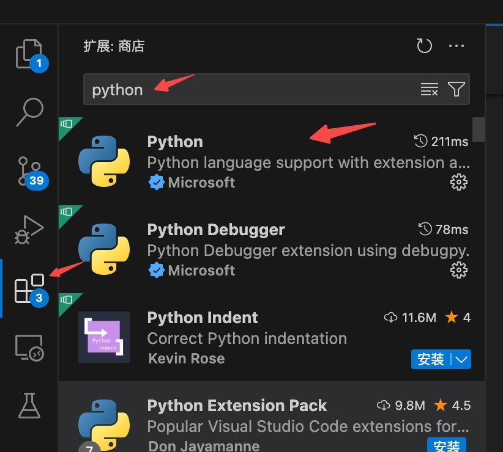
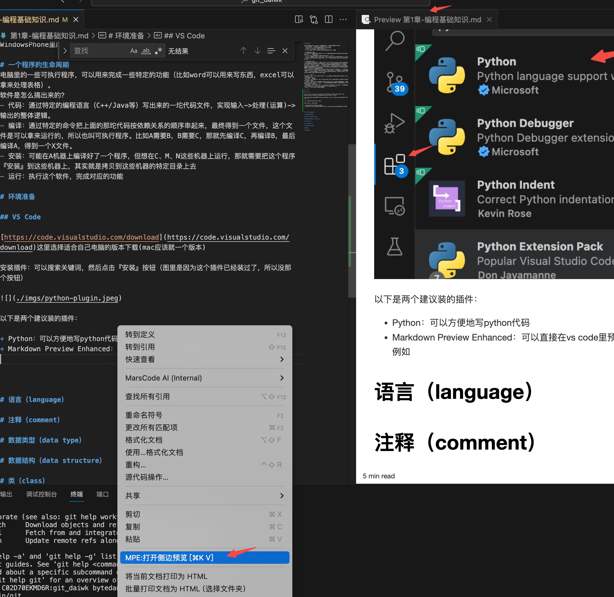
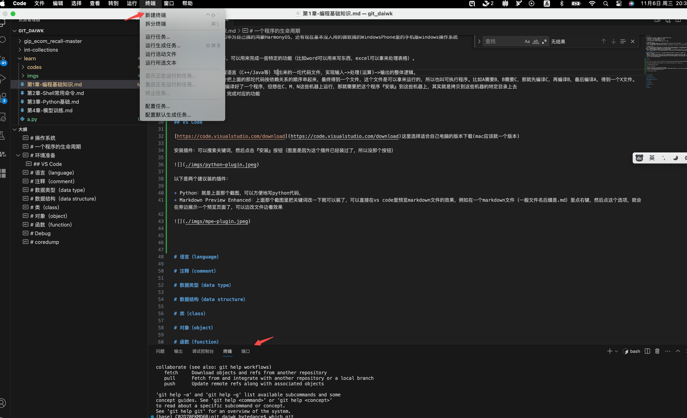
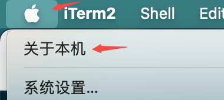
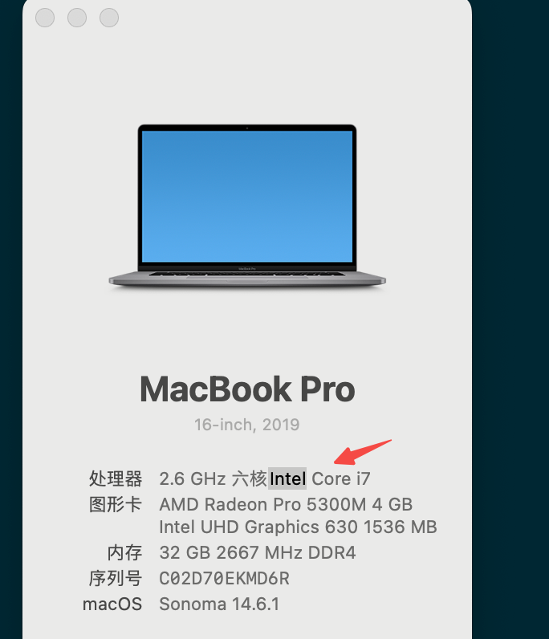
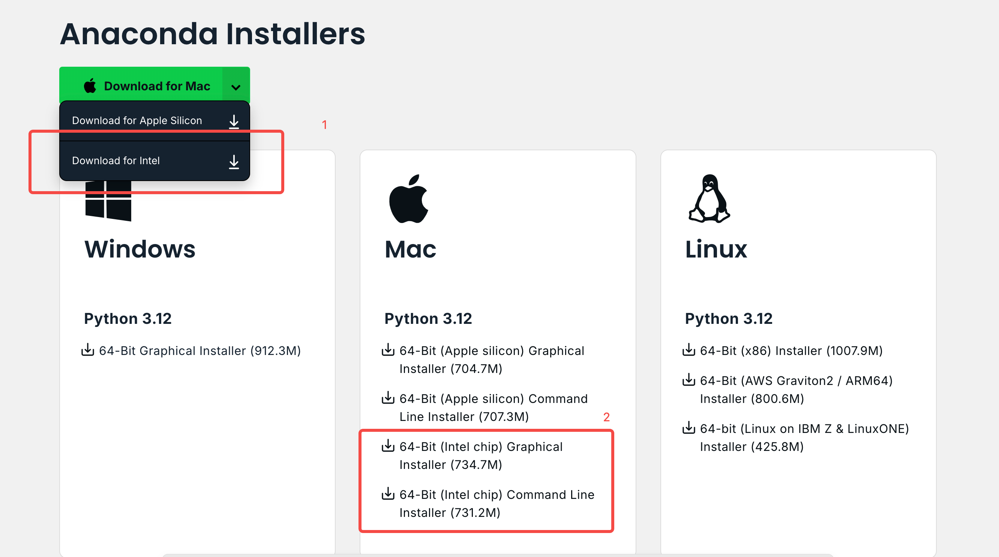
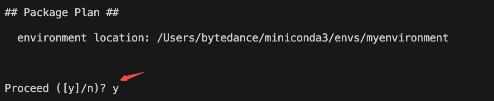
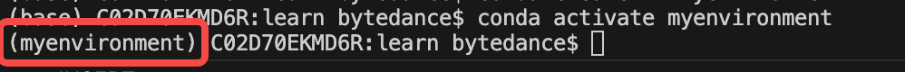

# 操作系统

操作系统（operating system, OS）负责硬件和软件之间的调度，例如：
- 这个软件需要一些文件，这些文件存储在哪个硬件上
- 程序运行的过程中，具体的运算需要多少cpu和内存
- 程序运行完，要把输出放到哪个硬件里去
- 有多个程序要一起运行的时候，怎么保证不冲突，怎么加速？

常见的电脑操作系统
- Windows：微软的闭源操作系统，是早期少见的可视化的界面，有『窗口』、『桌面』，还有各种易于通过鼠标操作的软件
- Mac OS X：苹果的闭源操作系统，比Windows晚一些出来
- Linux：开源的操作系统，主要是命令行，不像windows/macos那样有漂亮的图形界面，但对于普通程序员来讲已经足够用了。当然，也有图形界面做的比较好的Linux，例如Ubuntu、CentOS等

常见的手机操作系统
- 安卓（Android）：谷歌的开源操作系统，类似Linux，没有官方的应用商店，各家手机都有自己的，比如Google的商店、小米的商店、腾讯的应用宝、oppo的商店。当然也可以不通过应用商店，只要通过Java写一个app，拿着这个app的安装包（文件名以『apk』结尾，即例如 toutiao.apk）就能安装了。由于是开源的，虽然有一些约定俗称的『规定』，但大家其实只要获得了高级管理员权限（常说的root权限），就可以直接改最底层的东西，比如某app就可以绕开各种权限检查直接偷偷给你截屏啥的。
- 苹果（iOS）：苹果的闭源操作系统，有官方的应用商店，程序员可以基于苹果的编程语言（Objective-C，简称obj-c，或者oc）来写一个app，想发布一个app需要通过官方的各种审核
- 还有一些特殊的，比如华为自己搞的鸿蒙HarmonyOS，还有现在基本没人用的微软搞的WindowsPhone里的手机版windows操作系统

# 一个程序的生命周期
电脑里的一些可执行程序，可以用来完成一些特定的功能（比如word可以用来写东西，excel可以拿来处理表格）。
软件是怎么搞出来的？
- 代码：通过特定的编程语言（C++/Java等）写出来的一坨代码文件，实现输入->处理(运算)->输出的整体逻辑。
- 编译：通过特定的命令把上面的那坨代码按依赖关系的顺序串起来，最终得到一个文件，这个文件是可以拿来运行的，所以也叫可执行程序。比如A需要B，B需要C，那就先编译C，再编译B，最后编译A，得到一个X文件。
- 安装：可能在A机器上编译好了一个程序，但想在C、M、N这些机器上运行，那就需要把这个程序『安装』到这些机器上，其实就是拷贝到这些机器的特定目录上去
- 运行：执行这个软件，完成对应的功能

# 环境准备

## VS Code

[https://code.visualstudio.com/download](https://code.visualstudio.com/download)这里选择适合自己电脑的版本下载(mac应该就一个版本)

### 插件

安装插件：在左边的侧边栏里，点这个图标，然后搜索关键词，再点击『安装』按钮（图里是因为这个插件已经装过了，所以没那个按钮）



以下是两个建议装的插件：

+ Python：就是上面那个截图，可以方便地写python代码，
+ Markdown Preview Enhanced：上面那个截图里把关键词改一下就可以装了，可以直接在vs code里预览markdown文件的效果，例如在一个markdown文件（一般文件名后缀是.md）里点右键，然后点这个选项，就会在旁边展示一个预览页面了，可以边改文件边看效果



### 终端

打开终端，在顶部的菜单里，点击『终端』->『新建终端』



终端(terminal)一般就是用来运行一些命令的地方，比如安装一些软件，运行一些程序等。

例如输入下面这个命令，就会列出当前目录下的所有文件

```shell
ls -l
```

显示的就是

```
aabbccdd:learn x$ ls -l
total 40
drwxr-xr-x  5 x  aa   160 10 21 16:32 codes
drwxr-xr-x  7 x  aa   224 11  6 20:32 imgs
-rw-r--r--  1 x  aa    75 11  6 20:38 run.sh
-rw-r--r--@ 1 x  aa  4040 11  6 20:37 第1章-编程基础知识.md
-rw-r--r--@ 1 x  aa    24 10 21 16:21 第2章-Shell常用命令.md
-rw-r--r--@ 1 x  aa    45 10 21 16:18 第3章-Python基础.md
-rw-r--r--@ 1 x  aa   335 10 28 15:36 第4章-模型训练.md
```

更多的命令我们在下一章再来介绍，这里就不展开啦。

## anaconda

简单来说，就是在你的电脑上启动一个虚拟环境，在这个环境里能安装各种软件，和你的电脑上的软件隔离开，避免冲突。一般我们会在这个虚拟环境里安装python，然后在这个虚拟环境里运行python程序。

这里需要看下自己的电脑是哪一种芯片，首先点电脑左上角的这个按钮



然后看弹出来的界面里，如果这里有intel，那就是intel芯片，否则就是另一种苹果的芯片



打开这个网页[https://www.anaconda.com/download/success](https://www.anaconda.com/download/success)，下载对应版本的anaconda安装包：



安装过程就是一路往下点继续+同意就行。

然后在终端里输入如下命令，就建好了一个名为```myenvironment```的环境

```shell
conda create -n myenvironment
```

看到这个提示的时候，输入y，再按回车就行（表示同意安装，当然也可以直接按回车，因为这里```[y]```的中括号就表示什么都不输入的话，默认y）



等运行完了后，输入如下命令，就能激活这个环境了

```shell
conda activate myenvironment
```

可以看到终端的最前面多了个```(myenvironment)```



常用的一些命令：

+ ```conda deactivate```：退出当前环境
+ ```conda install matplotlib```：在当前环境里安装```matplotlib```这个python库，安装过程中同样看到```Proceed ([y]/n)? ```这种提示就输入y，再按回车就行。这个命令其实等价于```pip3 install matplotlib```，也就是使用python默认的pip3这个包管理器来安装python库。
  + 指定想要安装的python库的版本：```pip3 install torch==2.1.2```，安装是2.1.2版本的torch

# 语言（language）

# 注释（comment）

# 数据类型（data type）

# 数据结构（data structure）

# 类（class）

# 对象（object）

# 函数（function）

# Debug

# coredump

