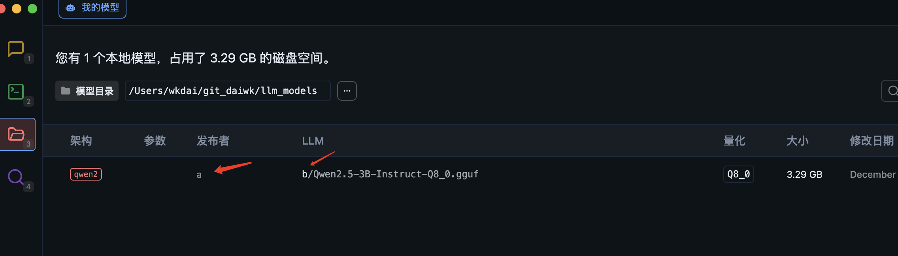

# 用LM-studio来本地跑大模型

## 安装lm-studio

去官网下载[https://lmstudio.ai/](https://lmstudio.ai/)，这里需要连vpn，


下载后双击打开，拖进去就安装好了


## 模型下载

[https://hf-mirror.com/lmstudio-community](https://hf-mirror.com/lmstudio-community)去这个网站下载lm-studio适用的开源大模型，可以在这里搜qwen（qianwen，国内开源模型里比较好的模型，是阿里的千问模型，不是您那个邮箱名啦）


比如这个[https://hf-mirror.com/lmstudio-community/Qwen2.5-3B-Instruct-GGUF](https://hf-mirror.com/lmstudio-community/Qwen2.5-3B-Instruct-GGUF)，然后点击```files and versions```，再找一个.gguf文件，点那个下载按钮，放到本地的某个目录下。

注意：这里的目录名有要求，得是```xxx//a/b/```这种目录格式，也就是说最后要有a这个子目录，然后a下面有一个b目录，下载的文件放到b目录下去（表示的是a这个作者，创建了一个b模型），如果你要下载另一个模型，那可以在a目录下建一个c目录，把新模型放到c目录下去


想下载多大的文件，取决于你的电脑有多少显存/内存，如果是mac那还是看内存吧(点电脑左上角的苹果图标，再点“关于本机”)，可见显存是16g


找一个**比16g内存小**的文件来下载就行了。其中，gguf的含义如下：


## 更改模型目录

打开lm-studio，然后点这里，选择你的那个```xxx```目录（即下载目录a的上级目录）


然后就可以发现这里显示的是a作者的b模型了



## 加载模型并开始聊天

点左边这个，然后点加载模型


然后直接用默认的设置，点加载模型就行了


然后就可以直接和它聊天了！


# 大模型原理简介

